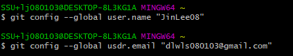
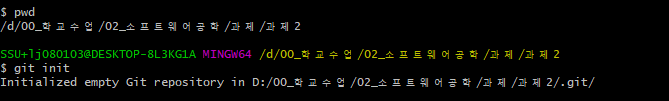
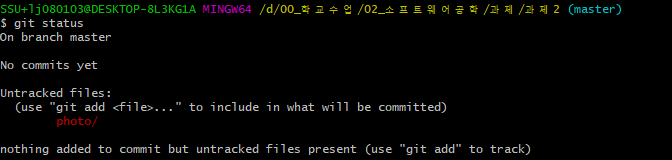
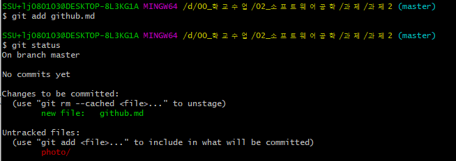
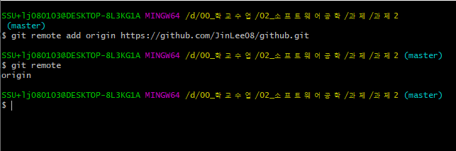
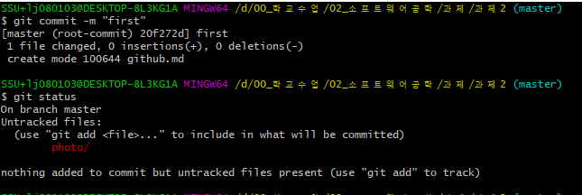
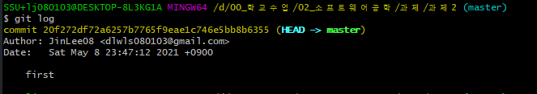
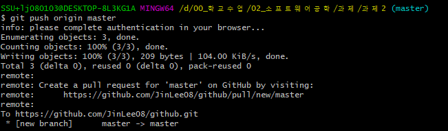

[GitHub repository URL](https://github.com/JinLee08/github.git)
# git & GitHub 학습하기
## 소프트웨어공학 과제2
### 컴퓨터학부 20201493 이진
___
## git
git은 로컬, 리모트 저장공간 등을 브랜치로 관리하는 분산 버전 관리 시스템입니다.  
### git의 영역
git에 대해 자세히 알아보기 전 ***git의 영역*** 에 대해 알아보면 나머지 내용을 더 수월하게 이해할 수 있습니다.  

- Working Directory : 실제로 작업하는 프로젝트 폴더
- Repository
  - Local : 사용자가 작업하는 PC에 만들어 놓은 저장소
  - remote : 원격 저장 서버 e.g.GitHub
- Index : Working Directory에서 Repository로 전송하기 전 영역
  - status 명령어를 사용하여 파일 상태를 확인할 수 있습니다.
- Stash : 위 3가지와 다른 별개의 영역으로 임시적으로 작업사항 저장가능

___

### git의 명령어
#### 1. config
git을 설치한 이후 아직 사용자 설정이 안되어 있는 상태이기 때문에 사용자 등록을 위해서 **config명령어**를 사용하도록 합니다.  
  

    git config --list  

위와 같이 --list 옵션을 사용하면 현재 설정 정보를 조회할 수 있습니다.

#### 2. init
사용자 등록을 마쳤다면 로컬 저장소가 없는 상태이기 때문에 **오프라인에서 사용할 수 있는 Local Repository**를 생성하기 위해서 **init 명령어**를 사용하도록 합니다.  

  

#### 3. status
저장소를 만들은 상태에서 현재 파일 상태를 알고 싶다면 **status 명령어**를 사용하면 됩니다.  

  

#### 4. add
위 사진을 보면 **Untracked files**가 뜨는데 이것은 ***add를 하지 않은 상태의 파일*** 을 가리키는 말입니다.  
이 상태에서 파일을 생성한 후 파일의 버전관리를 위해 Repository추가하기 전 단계로 Index에 파일을 저장하기 위해서는 **add명령어** 를 사용해야 합니다.  

다시 status 명령어를 사용해보면 Changes to be committed에 github.md 파일이 추가된 것을 볼 수 있습니다.  
  
> 옵션 -A, --all을 사용하면 변경된 모든 파일을 추가 할 수 있습니다.

#### 5. remote
현재는 로컬 저장소에만 파일이 저장되어 있는 상태입니다. 효과적인 버전관리를 GitHub에서 생성한 Remote Repository에 저장하기 위해서는 우선 **remote명령어**를 사용해 리모트 저장소를 추가해주어야어야 합니다. 기본적인 형태는 다음과 같습니다.

    git remote add [사용할_이름][Repository URL]  
   

다시 remote 명령어를 사용하면 원격저장소를 확인할 수 있습니다.

#### 6. commit
이제 추가된 변경사항을 확정하기 위해서 **commit명령어**를 사용해야 합니다.

    git commit -m "메시지"  
 
 
를 사용하여 파일들을 커밋할 수 있습니다.  

#### 7. log
커밋을 한 후 커밋되었는지를 화인하고 싶다면 **log 명령어**를 사용하면 됩니다.  

#### 8. push
커밋이 정상적으로 완료된 것을 확인하였다면 **push 명령어**를 사용하여 원겨저장소에 저장해줍니다.  

### **사용한 git 명령어 모음**
|명령어|사용여부|
|------|---|
|add|O|
|branch||
|checkout||
|clone||
|commit|O|
|config|O|
|init|O|
|log|O|
|merge||
|pull||
|push|O|
|rebase||
|remote|O|
|reset--hard||
|status|O|
|tag||

> - 참고자료 1 : https://git-scm.com/book/ko/v2
> - 참고자료 2 : [갓대희의 작은공간 | [웹개발 기초] 6.개발도구/6_3 GIT](https://goddaehee.tistory.com/91?category=381481)
